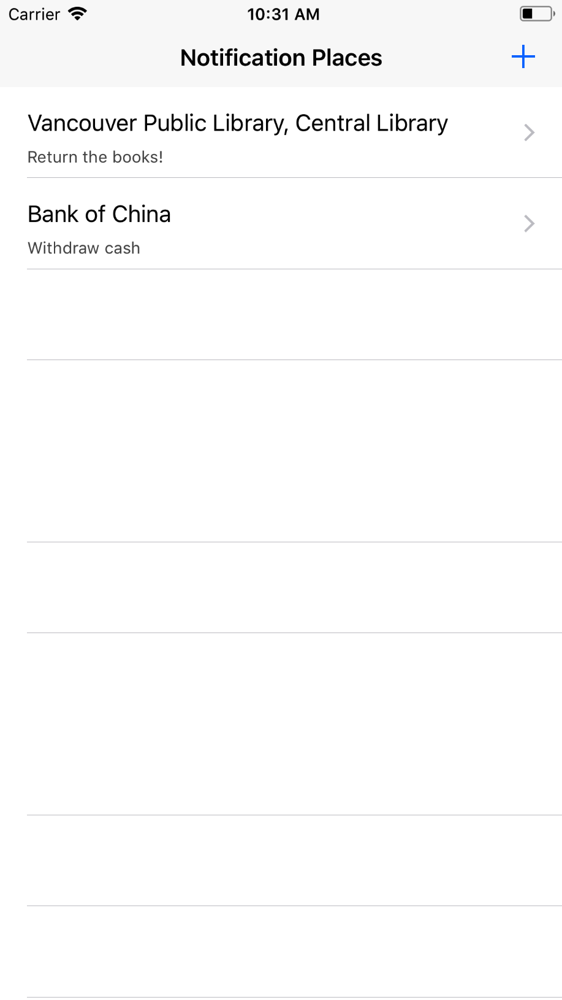
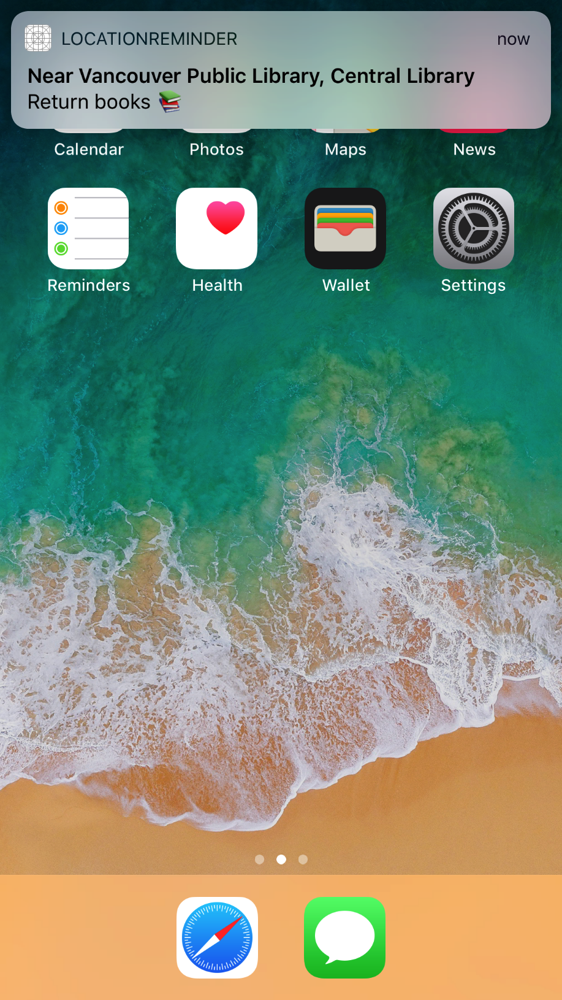
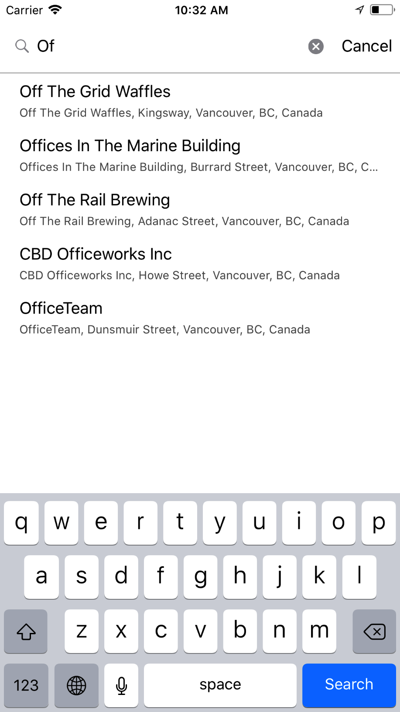
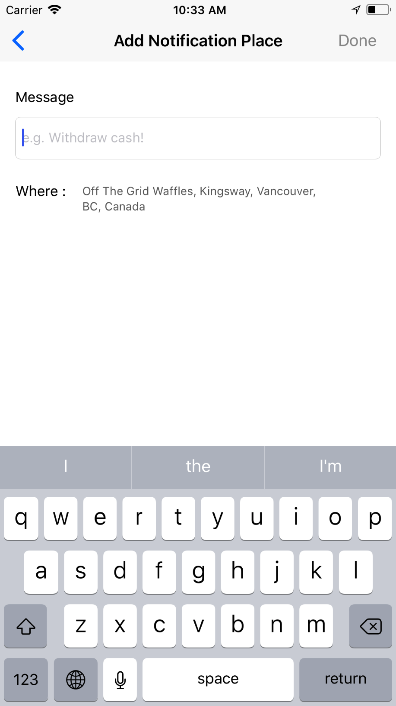
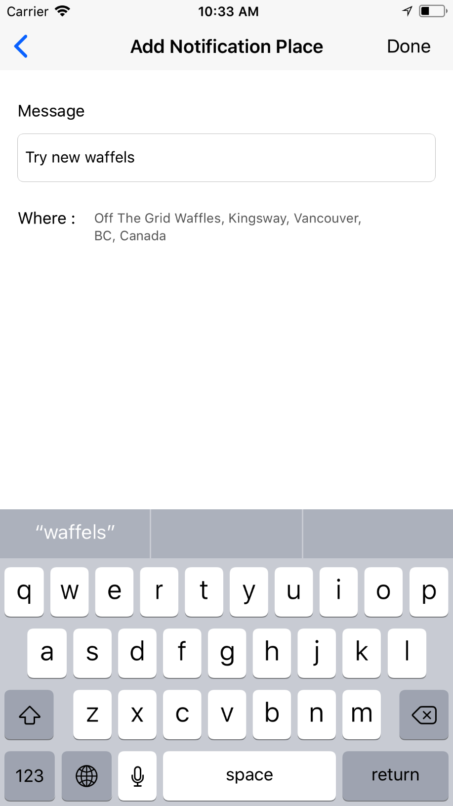
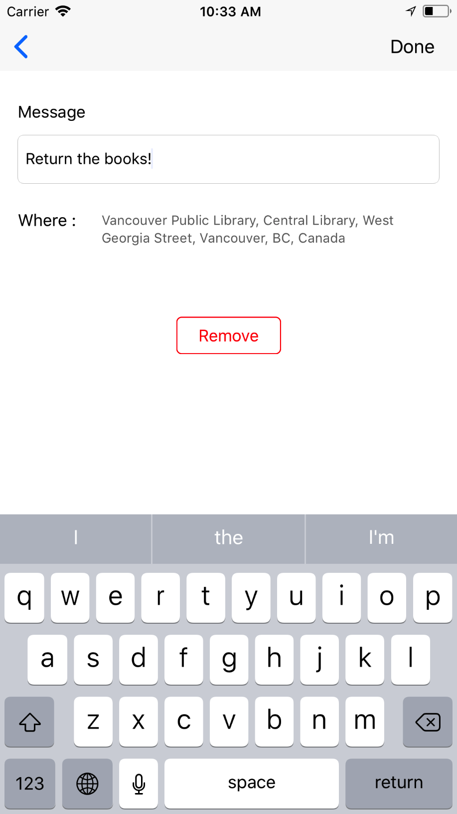
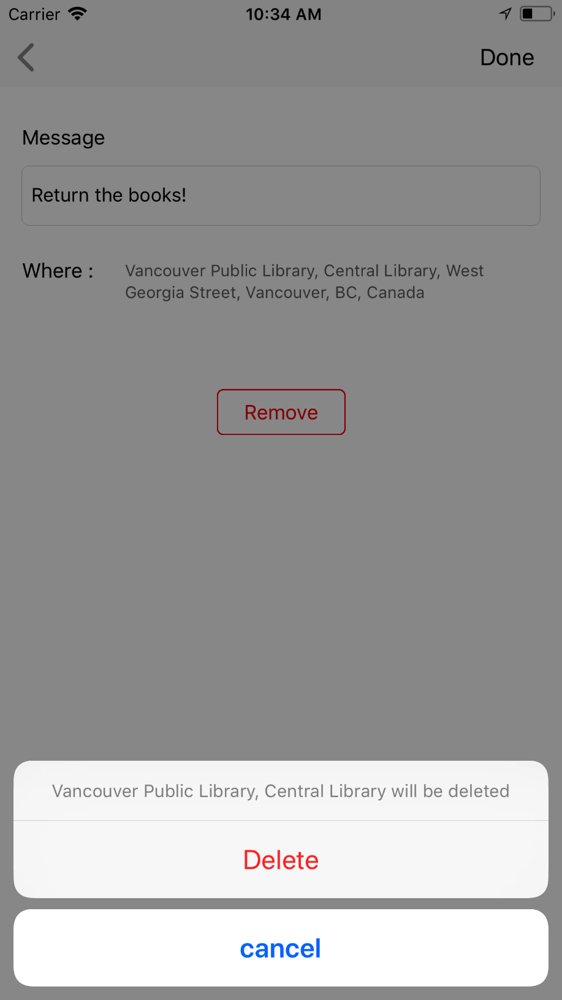

# What is Location Reminder?

The app you can get the notification when you go around the place you registered with a message you wrote.

    

## Step 1

Find the place you need to get notification
It’s used Google Places API so it shows suggestions and it’s connected your current place.

## Step 2

Write the message that will be the body text of the notification.
Message is required so if there’s no words in the text field, you cannot tap the “Done” button on navigation bar.

   

## That’s it!

You can edit the message and remove the items.

   
