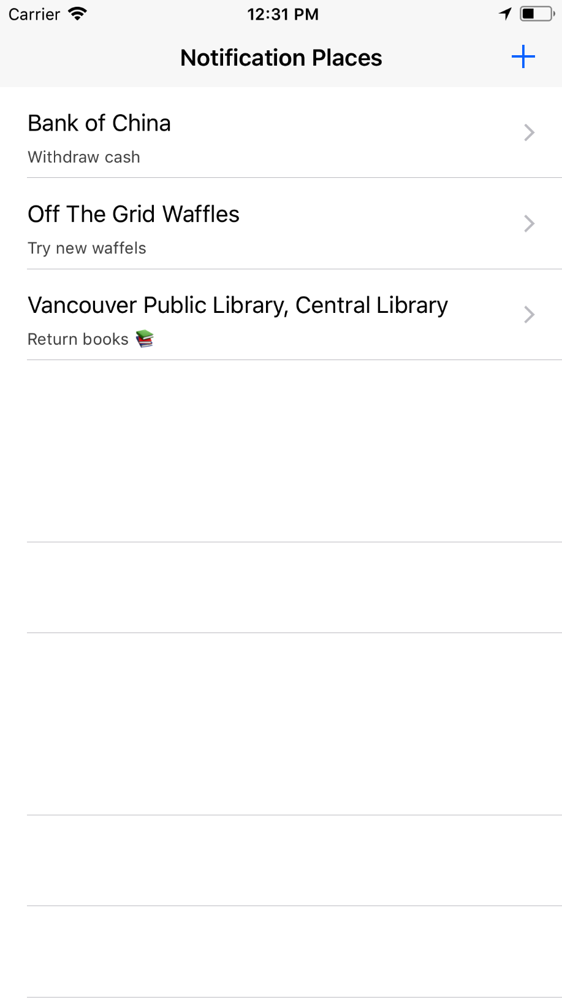

# What is Location Reminder?

The app you can get the notification when you go around the place you registered with a message you wrote.

    

## Step 1

Find the place you need to get notification
It’s useded Google Places API so it shows suggestions and it’s based on the user's current location.

## Step 2

Write the message that will be the body text of the notification.
Message is required so if there’re no words in the text field, you cannot tap the “Done” button on the navigation bar.

   

## That’s it!

You can edit the message and remove the items anytime you want.

   
